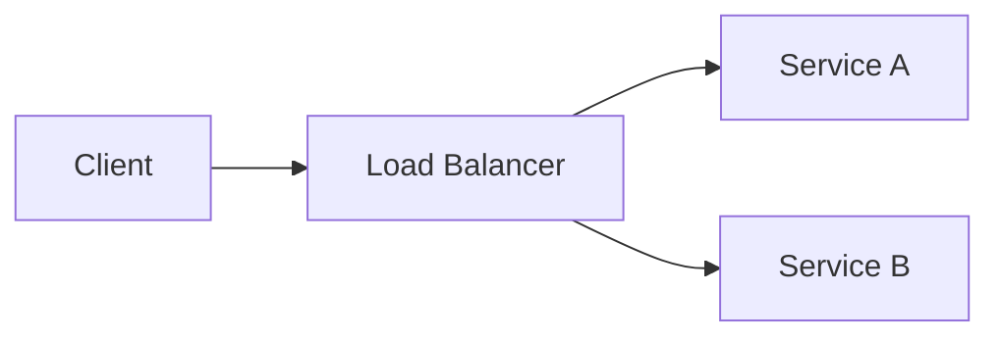

# Contributing to Modern System Design Primer

Thank you for your interest in contributing. This guide ensures consistency across all content.

## Voice and Tone

This primer speaks to working engineers building production systems. Write as if explaining to a competent colleague—not lecturing a student or impressing an interviewer.

### Voice Rules

**Use active voice.** The subject acts.
- Yes: "Redis stores data in memory"
- No: "Data is stored in memory by Redis"

**Cut filler words.** Delete these on sight: actually, very, just, basically, simply, really, quite, rather.

**Be specific.** Don't say "This is important"—say *why* it matters.
- Yes: "Consensus algorithms prevent split-brain scenarios that corrupt data"
- No: "Consensus is an important concept in distributed systems"

**Lead with outcomes.** Start paragraphs with what the reader gains.
- Yes: "Sharding distributes load across machines, letting you scale beyond single-node limits"
- No: "In this section, we will discuss sharding"

### Formatting Rules

| Element | Rule | Example |
|---------|------|---------|
| Numbers | Spell out one through nine; numerals for 10+ | "three replicas" vs "12 nodes" |
| Emphasis | Italics only (reserve bold for callout headers) | *eventual consistency* |
| Commas | Oxford comma always | "latency, throughput, and availability" |
| Em dashes | No spaces | "the tradeoff—latency for durability—matters" |
| Links | 2-4 words; never "click here" | "[Raft paper](https://example.com)" not "[click here](https://example.com)" |

## Content Structure

Every topic follows a three-tier structure with a TL;DR summary.

### Topic Template

```markdown
## Topic Name

### Core Concept

<!-- 2-3 paragraphs: what it is, why it matters, key tradeoffs -->
<!-- Lead with definition, follow with why, end with key tradeoff -->

### Practical Guidance

<!-- 3-5 paragraphs: when to use, recommendations, common mistakes -->
<!-- Start each paragraph with an actionable statement -->

> **Common mistake:** [Verb phrase describing the error and its consequence]

### Going Deeper

<!-- 3-5 links, ordered foundational → advanced, then by date (newer first) -->
- [Primary source](https://example.com) — Brief description
- [Engineering blog](https://example.com) | [archive](https://web.archive.org/example)

### TL;DR

<!-- 3-5 bullet summary for quick reference -->
- Key point 1
- Key point 2
- Key point 3
```

### Callout Types

Use blockquotes with bold headers:

```markdown
> **Common mistake:** Treating CAP as a menu where you pick two options upfront.

> **When to use this:** Your data fits in memory and you need sub-millisecond reads.

> **Warning:** Service meshes add latency and operational complexity. Start without one.
```

## Cross-References

### Internal Links

For actionable references (reader should navigate):
```markdown
[Foundations: CAP Theorem](../sections/01-foundations.md#cap-theorem)
```

For contextual hints (reader might navigate):
```markdown
Cassandra accepts eventual consistency (see Consistency Models in Foundations).
```

### Anchor Generation

GitHub generates anchors by:
1. Converting to lowercase
2. Replacing spaces with hyphens
3. Stripping special characters

Examples:
- "CAP Theorem" → `#cap-theorem`
- "TL;DR" → `#tldr`
- "Going Deeper" → `#going-deeper`

## External Links

### Requirements

1. **HTTPS only**—no HTTP links
2. **Reputable sources**—engineering blogs, official docs, academic papers
3. **Archive links**—case study sources must include archive.org backup
4. **Date annotations**—older resources need context: `[2017—foundational, some tools dated]`

### Approved Domains

- Engineering blogs: Netflix, Discord, Stripe, Figma, Cloudflare, Uber, Meta
- Official documentation: cloud providers, CNCF projects, language docs
- Academic: arxiv.org, ACM Digital Library, IEEE Xplore
- Standards: IETF RFCs, W3C specifications

### Prohibited

- URL shorteners (bit.ly, t.co, etc.)
- Personal blogs without established reputation
- Affiliate or referral links
- Paywalled content without free alternative

## Diagrams

**Mermaid first.** GitHub renders Mermaid natively. Use it for:
- Flowcharts
- Sequence diagrams
- Architecture diagrams

```markdown

```

**Alt text required** for complex diagrams:
```markdown
<!-- Diagram: Client requests flow through load balancer to service replicas -->
```

**SVG only when Mermaid cannot express** the concept (expect 3-5 total in the entire primer).

## Pull Request Process

1. **One topic per PR**—makes review manageable
2. **Run link check locally**—`npx lychee sections/*.md appendix/*.md`
3. **Include archive.org links** for new external sources
4. **Self-review against voice rules** before requesting review

### PR Checklist

```markdown
- [ ] Active voice throughout
- [ ] No filler words
- [ ] External links use HTTPS
- [ ] Archive.org backup for case study sources
- [ ] Follows topic template structure
- [ ] TL;DR section included
```

## Word Budgets

These are guidelines, not hard limits. Cut topics before cutting quality.

| Section | Target |
|---------|--------|
| 01-foundations.md | ~3,500 words |
| 02-compute.md | ~4,600 words |
| 03-data.md | ~5,100 words |
| 04-communication.md | ~3,600 words |
| 05-ai-ml.md | ~3,500 words |
| 06-operations.md | ~4,000 words |
| Case study (each) | ~875 words |

## Questions?

Open an issue with the `question` label. We respond within a few days.
